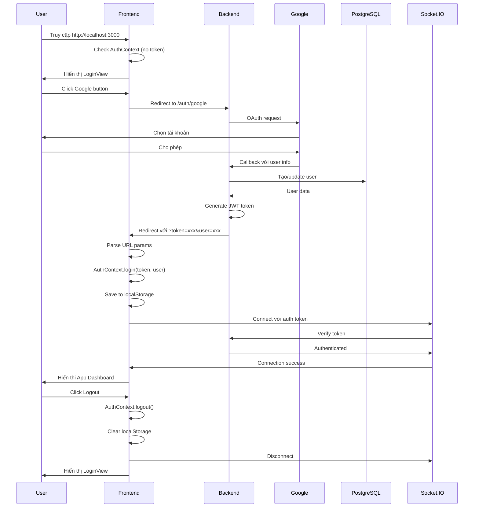

# Hướng Dẫn Test Luồng Đăng Nhập Hoàn Chỉnh

## ✅ Đã Hoàn Thành

Tôi đã tích hợp hoàn toàn backend API vào frontend với luồng authentication hoàn chỉnh:

### Những Gì Đã Làm

1. **✅ Cập nhật App.tsx**:
   - Sử dụng `AuthContext` thay vì mock authentication
   - Xóa logic authentication cũ (`isAuthenticated` state, `handleLogin`)
   - Tích hợp `logout()` từ AuthContext
   - Hiển thị `LoginView` khi chưa đăng nhập

2. **✅ Luồng Authentication Hoàn Chỉnh**:
   ```
   Chưa đăng nhập → LoginView
                    ↓
   Click Google button → Backend OAuth
                    ↓
   Google authentication → Callback với token
                    ↓
   AuthContext.login() → Lưu token + user
                    ↓
   Socket.IO connect với auth → Backend verify
                    ↓
   App hiển thị Dashboard → Đã đăng nhập!
   ```

3. **✅ Docker Containers**:
   - Backend: Running với Socket.IO
   - Frontend: Running với Nginx
   - PostgreSQL: Healthy

## 🚀 Cách Test Đầy Đủ

### Bước 1: Truy cập ứng dụng
```
http://localhost:3000
```

**Kết quả mong đợi**: Bạn sẽ thấy màn hình login đẹp với:
- Form đăng nhập email/password
- 3 nút social login (Google, GitHub, Phone)

### Bước 2: Đăng nhập bằng Google

1. Click vào nút **Google** (biểu tượng Chrome - nút đầu tiên)
2. Trình duyệt sẽ redirect đến Google OAuth
3. Chọn tài khoản Google của bạn
4. Cho phép ứng dụng truy cập

**Kết quả mong đợi**:
- Tự động redirect về `http://localhost:3000`
- Thấy dashboard của app (không còn màn hình login)
- Sidebar bên trái hiển thị menu
- Header phía trên với các controls

### Bước 3: Kiểm tra Authentication

#### A. Kiểm tra LocalStorage
Mở DevTools → Application → Local Storage → `http://localhost:3000`

Bạn sẽ thấy:
```
auth_token: "eyJhbGciOiJIUzI1NiIsInR5cCI6IkpXVCJ9..."
auth_user: "{\"id\":\"...\",\"email\":\"...\",\"name\":\"...\",\"avatar\":\"...\"}"
```

#### B. Kiểm tra Socket.IO Connection
Mở DevTools → Network → WS tab

Bạn sẽ thấy:
- WebSocket connection đến `localhost:3001`
- Status: `101 Switching Protocols` (thành công)
- Messages tab: Thấy các events như `authenticated`, `ping`, `pong`

#### C. Kiểm tra Backend Logs
```bash
docker-compose logs -f backend
```

Bạn sẽ thấy:
```
Client connected: [socket-id]
✅ Connected to Socket.IO server
🔐 Authenticated: { success: true, message: 'Authentication successful' }
```

### Bước 4: Test Các Chức Năng

#### A. Điều hướng trong App
- Click vào các menu items trong sidebar:
  - Dashboard
  - Portfolios
  - Analytics
  - Transactions
  - Alerts
  - Settings
  - Profile

**Kết quả mong đợi**: Mỗi view hiển thị đúng nội dung

#### B. Test Logout
1. Click vào avatar/profile trong sidebar
2. Click "Logout" hoặc tìm nút logout

**Kết quả mong đợi**:
- Quay về màn hình login
- LocalStorage bị xóa (`auth_token`, `auth_user`)
- Socket.IO disconnect
- Backend logs: `Client disconnected: [socket-id]`

#### C. Test Refresh Page
1. Đang ở trong app (đã đăng nhập)
2. Refresh page (F5 hoặc Cmd+R)

**Kết quả mong đợi**:
- Vẫn ở trong app (không bị logout)
- Token vẫn còn trong localStorage
- Socket.IO tự động reconnect

### Bước 5: Test Socket.IO Events (Advanced)

Mở DevTools Console và chạy:

```javascript
// Test ping
const socket = window.io('http://localhost:3001', {
  auth: { token: localStorage.getItem('auth_token') }
});

socket.emit('ping', {}, (response) => {
  console.log('Pong received:', response);
});

// Test get investments
socket.emit('investments:get', {}, (response) => {
  console.log('Investments:', response);
});
```

**Kết quả mong đợi**:
- Nhận được response từ backend
- Backend logs hiển thị các events

## 🔍 Kiểm Tra Kỹ Thuật

### 1. Kiểm tra Database
```bash
docker-compose exec postgres psql -U postgres -d investment_db

# Xem users đã đăng nhập
SELECT id, email, name, created_at FROM users;

# Xem investments (nếu có)
SELECT * FROM investments;
```

### 2. Kiểm tra Backend Health
```bash
curl http://localhost:3001/auth/status
```

Kết quả: `{"status":"Auth service is running"}`

### 3. Kiểm tra Frontend
```bash
curl http://localhost:3000
```

Kết quả: HTML của React app

## ⚠️ Troubleshooting

### Vấn đề 1: Sau khi đăng nhập vẫn thấy màn hình login

**Nguyên nhân**: Token không được lưu hoặc AuthContext không nhận được

**Giải pháp**:
1. Kiểm tra Console có lỗi không
2. Kiểm tra localStorage có `auth_token` không
3. Xem Network tab có request callback với token không
4. Restart containers: `docker-compose restart`

### Vấn đề 2: Socket.IO không kết nối

**Nguyên nhân**: Token không hợp lệ hoặc backend không chạy

**Giải pháp**:
1. Kiểm tra backend logs: `docker-compose logs backend`
2. Kiểm tra token trong localStorage
3. Thử logout và login lại
4. Kiểm tra CORS settings

### Vấn đề 3: Refresh page bị logout

**Nguyên nhân**: AuthContext không load token từ localStorage

**Giải pháp**:
1. Kiểm tra `AuthContext.tsx` có `useEffect` load từ localStorage
2. Xem Console có lỗi khi parse token
3. Clear localStorage và login lại

### Vấn đề 4: Google OAuth redirect về nhưng không có token

**Nguyên nhân**: Backend không tạo được token hoặc redirect URL sai

**Giải pháp**:
1. Kiểm tra backend logs xem có lỗi
2. Verify `GOOGLE_CLIENT_SECRET` trong backend/.env
3. Kiểm tra `FRONTEND_URL` = `http://localhost:3000`
4. Xem Network tab có redirect với params `?token=...&user=...`

## 📊 Luồng Dữ Liệu Hoàn Chỉnh



## ✨ Tính Năng Đã Hoàn Thành

- ✅ Google OAuth authentication
- ✅ JWT token management
- ✅ Persistent login (localStorage)
- ✅ Socket.IO real-time connection với auth
- ✅ Automatic reconnection
- ✅ Logout functionality
- ✅ Protected routes (App chỉ hiển thị khi authenticated)
- ✅ User data từ Google (email, name, avatar)
- ✅ Database persistence (PostgreSQL)

## 🎯 Kết Quả

Bây giờ bạn có một ứng dụng full-stack hoàn chỉnh với:
1. **Authentication**: Google OAuth với JWT
2. **Real-time**: Socket.IO v4 cho tất cả communication
3. **Database**: PostgreSQL lưu user data
4. **Frontend**: React với AuthContext
5. **Backend**: NestJS với Passport và TypeORM
6. **Docker**: Tất cả chạy trong containers

Hãy test ngay bằng cách:
1. Mở http://localhost:3000
2. Click nút Google
3. Đăng nhập
4. Thấy dashboard!

🎉 **Chúc mừng! Ứng dụng của bạn đã hoạt động hoàn chỉnh!**
